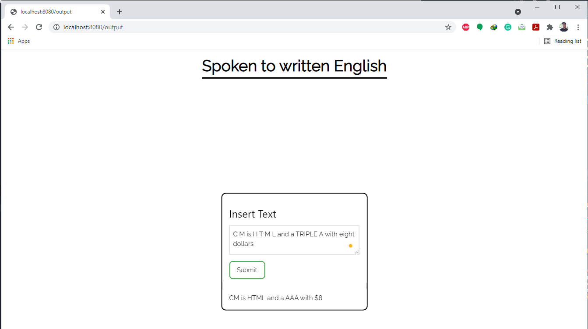

**Spoken to Written English**

This repo attempts to convert spoken digits to written ones.

Installation:
1. Clone this project repository
```bash
git clone https://github.com/asagar60/spoken_to_written_english
```
2. Install this python package
```bash
pip install dist\spoken_to_written_english-0.1-py3-none-any.whl
```

**Demo file**
https://colab.research.google.com/drive/1wGLt1AxNhJCZ-PiyW-wKA0UCZVoBnXf-?usp=sharing

**Usage**
```
from spoken_to_written_english.convert_spoken_to_written_digit import convert
convert(" three dollars and triple A")
```

**Results**
- convert("Triple A")    -  AAA
- convert("two dollars") -  $2
- convert("C M")         -  CM
- convert("C M is H T M L and a TRIPLE A with eight dollars") - CM is HTML and a AAA with $8

**API**


